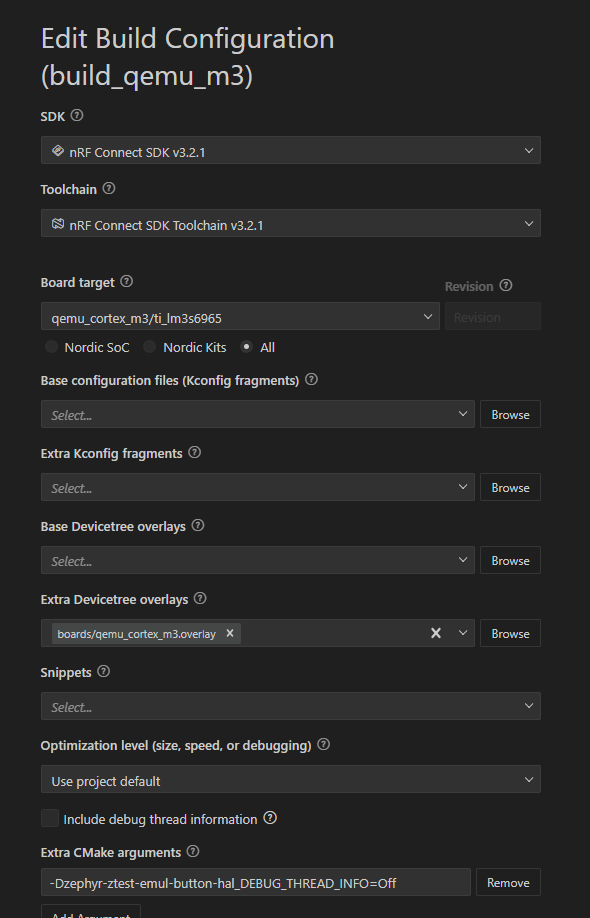
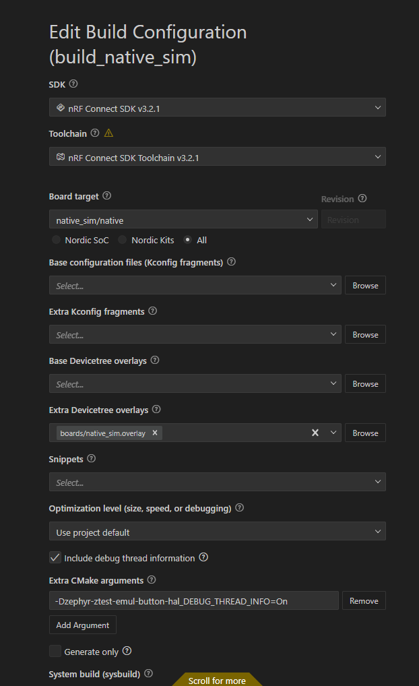

# Running

## Build & Run `root` on qemu_cortex_m3
```bash
west build --build-dir build_qemu -s . --pristine --board qemu_cortex_m3 -- -DEXTRA_DTC_OVERLAY_FILE="boards/qemu_cortex_m3.overlay" -DDEBUG_THREAD_INFO=On -DCONFIG_DEBUG_THREAD_INFO=y
west build -d build_qemu/zephyr-ztest-emul-button-hal -t run
```



```bash
royya@tuff16:~/project-coding/iot/zephyr-ztest-emul-button-hal$ west build -d build_qemu/zephyr-ztest-emul-button-hal -t run
-- west build: running target run
[0/1] To exit from QEMU enter: 'CTRL+a, x'[QEMU] CPU: cortex-m3
qemu-system-arm: warning: nic stellaris_enet.0 has no peer
Timer with period zero, disabling
*** Booting nRF Connect SDK v3.2.1-d8887f6f32df ***
*** Using Zephyr OS v4.2.99-ec78104f1569 ***
```


## Build & Run `root` on nrf5340dk

```bash
# Build
west build --build-dir /home/royya/project-coding/iot/zephyr-ztest-emul-button-hal/build_nrf5340dk /home/royya/project-coding/iot/zephyr-ztest-emul-button-hal --pristine --board nrf5340dk/nrf5340/cpuapp -- -DEXTRA_DTC_OVERLAY_FILE=boards/nrf5340dk_nrf5340_cpuapp.overlay -DDEBUG_THREAD_INFO=On -DCONFIG_DEBUG_THREAD_INFO=y -Dzephyr-ztest-emul-button-hal_DEBUG_THREAD_INFO=On

# Flash
lsusb
ls /dev/ttyACM*
west flash -d build_nrf5340dk

# Monitor
minicom -D /dev/ttyACM0 -b 115200
```

## Build & Run `root` on native_sim

### Using west build

```bash
west build --build-dir build_native_sim -s . --pristine --board native_sim/native -- -DEXTRA_DTC_OVERLAY_FILE="boards/native_sim.overlay" -DDEBUG_THREAD_INFO=On -DCONFIG_DEBUG_THREAD_INFO=y -Dzephyr-ztest-emul-button-hal_DEBUG_THREAD_INFO=On

build_native_sim/zephyr-ztest-emul-button-hal/zephyr/zephyr.exe
```



```bash
# Running
royya@tuff16:~/project-coding/iot/zephyr-ztest-emul-button-hal$ build_native/zephyr-ztest-emul-button-hal/zephyr/zephyr.exe
WARNING: Using a test - not safe - entropy source
*** Booting nRF Connect SDK v3.2.1-d8887f6f32df ***
*** Using Zephyr OS v4.2.99-ec78104f1569 ***
^C
Stopped at 5.200s
```

# Testing

## Build & Run `tests/biz_logic` on native_sim

### Using Twister

```bash
west twister -vv -n -T tests/biz_logic --outdir build_tests_twister
```

```bash
# Build & Run
royya@tuff16:~/project-coding/iot/zephyr-ztest-emul-button-hal$ west twister -vv -n -T tests/biz_logic --outdir build_tests_twister
INFO    - Using Ninja..
INFO    - Zephyr version: ncs-v3.2.1
INFO    - Using 'zephyr' toolchain.
INFO    - Selecting default platforms per testsuite scenario
INFO    - Building initial testsuite list...
INFO    - Writing JSON report build_tests_twister/testplan.json
INFO    - JOBS: 20
INFO    - Adding tasks to the queue...
INFO    - Added initial list of jobs to queue
INFO    - 1/1 native_sim/native         biz_logic.testing.ztest                            PASSED (native 0.008s <host>)
INFO    -                                    biz_logic_tests.boost_mode                                                  PASSED      
INFO    -                                    biz_logic_tests.magnet_detected                                             PASSED      
INFO    -                                    biz_logic_tests.default_state                                               PASSED      

INFO    - 1 test scenarios (1 configurations) selected, 0 configurations filtered (0 by static filter, 0 at runtime).
Summary
├── Total test suites: 1
├── Processed test suites: 1
│   ├── Filtered test suites: 0
│   │   ├── Filtered test suites (static): 0
│   │   └── Filtered test suites (at runtime): 0
│   └── Selected test suites: 1
│       ├── Skipped test suites: 0
│       ├── Passed test suites: 1
│       ├── Built only test suites: 0
│       ├── Failed test suites: 0
│       └── Errors in test suites: 0
└── Total test cases: 3
    ├── Filtered test cases: 0
    └── Selected test cases: 3
        ├── Passed test cases: 3
        ├── Skipped test cases: 0
        ├── Built only test cases: 0
        ├── Blocked test cases: 0
        ├── Failed test cases: 0
        └── Errors in test cases: 0
INFO    - 1 of 1 executed test configurations passed (100.00%), 0 built (not run), 0 failed, 0 errored, with no warnings in 18.77 seconds.
INFO    - 3 of 3 executed test cases passed (100.00%) on 1 out of total 1205 platforms (0.08%).
INFO    - 1 test configurations executed on platforms, 0 test configurations were only built.
INFO    - Saving reports...
INFO    - Writing JSON report /home/royya/project-coding/iot/zephyr-ztest-emul-button-hal/build_tests_twister/twister.json
INFO    - Writing xunit report /home/royya/project-coding/iot/zephyr-ztest-emul-button-hal/build_tests_twister/twister.xml...
INFO    - Writing xunit report /home/royya/project-coding/iot/zephyr-ztest-emul-button-hal/build_tests_twister/twister_report.xml...
INFO    - Run completed
```

### Using west build

```bash
west build -b native_sim -s tests/biz_logic -d build_tests_west -- -DEXTRA_DTC_OVERLAY_FILE=../../boards/native_sim.overlay
build_tests_west/biz_logic/zephyr/zephyr.exe
```

```bash
# Build
royya@tuff16:~/project-coding/iot/zephyr-ztest-emul-button-hal$ west build -s tests/biz_logic -b native_sim -d build_test -- -DEXTRA_DTC_OVERLAY_FILE=../../boards/native_sim.overlay
-- west build: generating a build system
Loading Zephyr module(s) (Zephyr base): sysbuild_default
-- Found Python3: /home/royya/ncs/toolchains/43683a87ea/usr/local/bin/python3.12 (found suitable version "3.12.4", minimum required is "3.10") found components: Interpreter 
-- Cache files will be written to: /home/royya/.cache/zephyr
-- Found west (found suitable version "1.4.0", minimum required is "0.14.0")
-- Board: native_sim, qualifiers: native
Parsing /home/royya/ncs/v3.2.1/zephyr/share/sysbuild/Kconfig
Loaded configuration '/home/royya/project-coding/iot/zephyr-ztest-emul-button-hal/build_test/_sysbuild/empty.conf'
Merged configuration '/home/royya/project-coding/iot/zephyr-ztest-emul-button-hal/build_test/_sysbuild/empty.conf'
Configuration saved to '/home/royya/project-coding/iot/zephyr-ztest-emul-button-hal/build_test/zephyr/.config'
Kconfig header saved to '/home/royya/project-coding/iot/zephyr-ztest-emul-button-hal/build_test/_sysbuild/autoconf.h'
-- 
   *******************************
   * Running CMake for biz_logic *
   *******************************

Loading Zephyr default modules (Zephyr base).
-- Application: /home/royya/project-coding/iot/zephyr-ztest-emul-button-hal/tests/biz_logic
-- CMake version: 3.21.0
-- Found Python3: /home/royya/ncs/toolchains/43683a87ea/usr/local/bin/python (found suitable version "3.12.4", minimum required is "3.10") found components: Interpreter 
-- Cache files will be written to: /home/royya/.cache/zephyr
-- Zephyr version: 4.2.99 (/home/royya/ncs/v3.2.1/zephyr)
-- Found west (found suitable version "1.4.0", minimum required is "0.14.0")
-- Board: native_sim, qualifiers: native
-- Found host-tools: zephyr 0.17.0 (/home/royya/ncs/toolchains/43683a87ea/opt/zephyr-sdk)
-- Found toolchain: host (gcc/ld)
-- Found Dtc: /home/royya/ncs/toolchains/43683a87ea/usr/bin/dtc (found suitable version "1.5.0", minimum required is "1.4.6") 
-- Found BOARD.dts: /home/royya/ncs/v3.2.1/zephyr/boards/native/native_sim/native_sim.dts
-- Found devicetree overlay: ../../boards/native_sim.overlay
-- Generated zephyr.dts: /home/royya/project-coding/iot/zephyr-ztest-emul-button-hal/build_test/biz_logic/zephyr/zephyr.dts
-- Generated pickled edt: /home/royya/project-coding/iot/zephyr-ztest-emul-button-hal/build_test/biz_logic/zephyr/edt.pickle
-- Generated devicetree_generated.h: /home/royya/project-coding/iot/zephyr-ztest-emul-button-hal/build_test/biz_logic/zephyr/include/generated/zephyr/devicetree_generated.h
Parsing /home/royya/ncs/v3.2.1/zephyr/Kconfig
Loaded configuration '/home/royya/ncs/v3.2.1/zephyr/boards/native/native_sim/native_sim_defconfig'
Merged configuration '/home/royya/project-coding/iot/zephyr-ztest-emul-button-hal/tests/biz_logic/prj.conf'
Merged configuration '/home/royya/project-coding/iot/zephyr-ztest-emul-button-hal/build_test/biz_logic/zephyr/.config.sysbuild'
Configuration saved to '/home/royya/project-coding/iot/zephyr-ztest-emul-button-hal/build_test/biz_logic/zephyr/.config'
Kconfig header saved to '/home/royya/project-coding/iot/zephyr-ztest-emul-button-hal/build_test/biz_logic/zephyr/include/generated/zephyr/autoconf.h'
-- Found GnuLd: /usr/bin/ld.bfd (found version "2.42") 
-- The C compiler identification is GNU 13.3.0
-- The CXX compiler identification is GNU 13.3.0
-- The ASM compiler identification is GNU
-- Found assembler: /usr/bin/gcc
-- Using ccache: /home/royya/ncs/toolchains/43683a87ea/usr/bin/ccache
-- Found gen_kobject_list: /home/royya/ncs/v3.2.1/zephyr/scripts/build/gen_kobject_list.py
-- Configuring done
-- Generating done
-- Build files have been written to: /home/royya/project-coding/iot/zephyr-ztest-emul-button-hal/build_test/biz_logic
-- Configuring done
-- Generating done
-- Build files have been written to: /home/royya/project-coding/iot/zephyr-ztest-emul-button-hal/build_test
-- west build: building application
[5/8] Performing build step for 'biz_logic'
[1/115] Preparing syscall dependency handling

[5/115] Generating include/generated/zephyr/version.h
-- Zephyr version: 4.2.99 (/home/royya/ncs/v3.2.1/zephyr), build: ncs-v3.2.1
[113/115] Linking C executable zephyr/zephyr.elf
Generating files from /home/royya/project-coding/iot/zephyr-ztest-emul-button-hal/build_test/biz_logic/zephyr/zephyr.elf for board: native_sim
[115/115] Running utility command for native_runner_executable
[8/8] Completed 'biz_logic'

# Run
royya@tuff16:~/project-coding/iot/zephyr-ztest-emul-button-hal$ /home/royya/project-coding/iot/zephyr-ztest-emul-button-hal/build_test/biz_logic/zephyr/zephyr.exe
WARNING: Using a test - not safe - entropy source
*** Booting nRF Connect SDK v3.2.1-d8887f6f32df ***
*** Using Zephyr OS v4.2.99-ec78104f1569 ***
Running TESTSUITE biz_logic_tests
===================================================================
START - test_boost_mode
 PASS - test_boost_mode in 0.000 seconds
===================================================================
START - test_default_state
 PASS - test_default_state in 0.000 seconds
===================================================================
START - test_magnet_detected
 PASS - test_magnet_detected in 0.000 seconds
===================================================================
TESTSUITE biz_logic_tests succeeded

------ TESTSUITE SUMMARY START ------

SUITE PASS - 100.00% [biz_logic_tests]: pass = 3, fail = 0, skip = 0, total = 3 duration = 0.000 seconds
 - PASS - [biz_logic_tests.test_boost_mode] duration = 0.000 seconds
 - PASS - [biz_logic_tests.test_default_state] duration = 0.000 seconds
 - PASS - [biz_logic_tests.test_magnet_detected] duration = 0.000 seconds

------ TESTSUITE SUMMARY END ------

===================================================================
PROJECT EXECUTION SUCCESSFUL
```